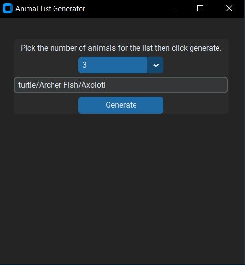
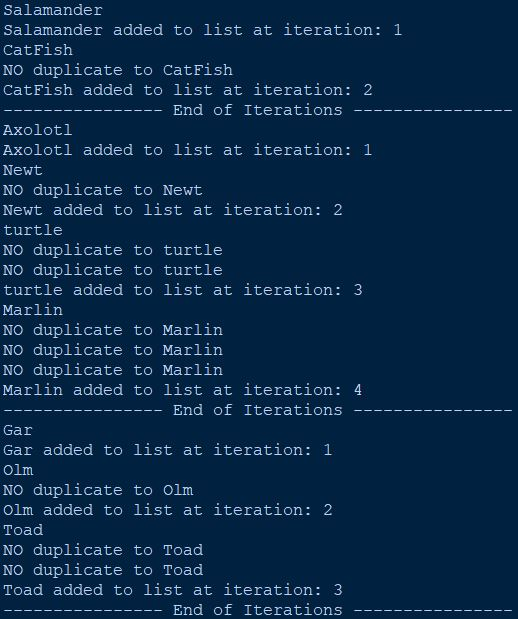

# Animal-List-Generator_Python
A simple Python GUI app that generates a random list of animals for the purpose of worldbuilding fictional stories
 - - - -
This app is designed for worldbuilders who are wanting to design fictional animals for their story but don't know where to start. They pick the desired list length from the dropdown menu for the length of the list. Then they click the 'Generate' button. This creates a list of random animal names. These animal names are stored in a sqlite database in the app.
 - - - -

## Images
#### App Interface

#### App Console

